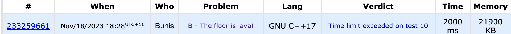

# [B. The floor is lava!](https://codeforces.com/gym/104782/problem/B)

## Interpetation
Problem Statement: <br>
K people in the room of size n by m. Each position has a number a that represents the height of the cell. A person moves up,down,left,right one unit in one second. The maximum height of the cell is n * m. L ranges from 0 to n * m
Find the minimum time for all L from 0 to n * m.

Main Points:
- Must find shortest distance to cell of height L for any starting point. 
- The shortest distance from two points is given by their manhattan distance

# Approach
## Brute Force
- First arrange it so we can iterate from the highest height cells to lowest i.e., using a unordered_map
- Globally Maintain a vector that is size n * m where vec[i] is the <b>maximum</b> time required to wait for lava level i
- Iterate for every k in K participants and measure the manhattan distance for every cell (n * m) FROM heighest to lowest cell (since we sorted it). For each l take the maximum of the time required by contestant or constenstants so far
    - Notes:
    - Maitain a minimum manhattan distance prev_d
    - If the cell height h is reached with manhattan distance d, check to see if `d < prev_d then min_d = d otherwise min_d = prev_d`. In the vec_k set the best distance to level h is min_d i.e., `vec_k[h] = min_d`
    - When we finish iterating through all cells we will be left with vec_k that has the shortest time required to wait for lava of height l. vec_k[l] = shortest distance to wait for laval height l


Time complexity: O(K * n * m)

Space Complexity: O(n * m)

In terms of time:
K <= 10,000 and m,n <= 700 thus atleast 1,400,000,000 operations, assuming 3 Ghz CPU then 3 operations/1ns  1,400,000,000 operations <= 0.5 seconds 

In terms of memory Total Memory >= 700 * 700 * 32 = 4480000 bits = 5mb

## Implementation

```C++

vector<int> lava_wait_room(vector<vector<int>> &room, vector<pair<int, int>> &positions)
{
    int n = room.size();
    int m = room[0].size();
    vector<int> max_wait(n * m + 1, -1);

    int n_participants = positions.size();
    unordered_map<int, vector<pair<int, int>>> map;

    /* Order the room by cells by height */
    for (int i = 0; i < n; i++)
    {
        for (int j = 0; j < m; j++)
        {
            map[room[i][j]].push_back({i, j});
        }
    }

    /* Determine the time to wait for each participant */
    for (int k = 0; k < n_participants; k++)
    {
        /* make positions 0-indexed*/
        int kpos_x = positions[k].first - 1;
        int kpos_y = positions[k].second - 1;
        /* prev_d records the fastest time to get to a cell of height h, since we are
        iterating largest h to smallest h, it means we can use prev_d for the current h */
        int prev_d = -1;

        for (int l = n * m; l >= 0; l--)
        {
            /* small_d is the shortest wait time achievable by person k to get to a cell of
            height it->first */
            int small_d = prev_d;
            if (map.find(l) != map.end())
            {
                for (auto pos : map[l])
                {
                    int dist = abs(pos.first - kpos_x) + abs(pos.second - kpos_y);
                    if (small_d == -1 || dist < small_d)
                    {
                        small_d = dist;
                    }
                }
            }

            prev_d = small_d;

            if (max_wait[l] == -1 || max_wait[l] < small_d)
            {
                max_wait[l] = small_d;
            }
        }
    }
    return max_wait;
}
```

###  Results 
Unfortunately the brute force solution failes on test case 10. Thus we must find a faster solution. Possibly taking advantage of the 256mb given (Only utilizing 21mb)



## Non Brute Force and or Optimizations
Utilise [Range Minimum Queries](https://en.wikipedia.org/wiki/Range_minimum_query) and rephrase the question

## Approach 

We consider the problem statement again "Find the minmum <span style="color:green">Time Waited (T)</span> for each given <span style="color:green"> Lava level </span>.
i.e., L $\Rightarrow$ T. However we notice that L $\leq$ 10,000. Instead we can rephrase the question as Find the maximum <span style="color:green"> Lava level </span> given each <span style="color:green"> Time Waited </span>. i.e., T $\Rightarrow$ L this is only upper bounded by n + m $\leq$ 1400.


Once we have found the maximum lava level reachable $1 \leq l_{t\_max} \leq n * m$ given each time waited, $1 \leq t_i \leq n + m$, for each person, taking the lower bound since we want to find the slowest person, then we know that certainly the time required to wait to reach a height of  $l_{t\_max\_reachable}  \leq t_i$.

Infact we know that as we go towards $t_i \rightarrow n + m$, $l_{t\_max\_reachable} \rightarrow n * m$. Therefore we can find the first instance of time $t_i$ that allows all the participants to travel to a  lava level reachable greater than the set L by the operator.

Whats left to solve is how we can find the maximum laval level reachable for each t for each person in reasonable time

Notice that for a any position $p_{i,j}$ and steps/time $t$ this forms a diamond centered around $p_{i,j}$. Also $l_{t\_max\_reachable} = \max(l_{t-1\_max\_reachable},\textnormal{max of outer diagonals t})$ thus we can use dynamic programming to calculate each $t/r$.

Finally the outer diagonals form four arrays, we can find the maximum of each one using <span style="color:yellow">Range Minimum Queries</span> to find the maximum of from the four arrays. Further more there are n + m unique diagonals to calculate thus we have a time complexity of $(n + m)*n*log_2(n) =  O(n^2 log(n))$ for the construction of the range minimum query.

Since queries can be done in $O(1)$ the time complexity of the calculation step is $ (n + m) * K = O(n*K)$ and altogether it is

 Overall Time Complexity: $O(n^2*log(n) + n*K)$
 Overall Space Complexity: $O(n^2*log(n))$


 #### Additional Notes on optimizing implementation
 - The Range Minimum Queries will be swapped to Maximum Queries obviously
 - Use of the $log_2$ version to find overlapping/fitting segments
 - The original map will be rotated $45 \degree$ to form a diamond shape making it easier to calculate the diagonals surrounding the participants which are now rows and columns

Example $45 \degree$ rotation
```
1 2 3     
2 3 4     
3 4 5     

     1
   2   2
 3   3   3
   4   4
     5

```
```
 1 2 3 4 5
 2 3 4 5 6
 3 4 5 6 7

      1     
    2   2
  3   3   3
    4   4   4
      5   5   5
        6   6
          7     
```
Noticable patterns when rotating $45 \degree$
- Bottom left coner alligns with column 0
- Top right corner alligns with the last column
- The size of a row is n + m - 1
- Upper left and lower right defines row 0 and last row 
- distnace between them is n + m - 1
- row_memo[i][j][k] is the ith rows  RMQ[k, $2^j$]
- For any position p the equivalent on the rotate is 
- The corresponding rows and columns are given the diagonal traveled r
## Implementation


### Rotating the matrix 45 degree
Done in three steps:
- filling the left offsets
- filling the values starting by bottom left corner
- filling the remaining right padding

Most loops are broken into two parts 
```C++
int vertOffset = n - 1;

    /* fill in all the offsets */
    for (int i = 0; i < m + n - 1; i++)
    {
        if (i < n)
        {
            for (int k = 0; k < n - 1 - i; k++)
            {
                room_rot[i].push_back(0);
            }
        }
        else
        {
            for (int k = 0; k < i - n + 1; k++)
            {
                room_rot[i].push_back(0);
            }
        }
    }

    for (int i = n - 1; i >= 0; i--)
    {
        for (int j = 0; j < m; j++)
        {
            room_rot[vertOffset + j].push_back(room[i][j]);
            room_rot[vertOffset + j].push_back(0);
        }
        vertOffset -= 1;
    }

    /* fill all the 0 in the end */
    for (int i = 0; i < n + m - 1; i++)
    {
        room_rot[i].pop_back();
        if (i < m)
        {
            for (int k = 0; k < m - 1 - i; k++)
            {
                room_rot[i].push_back(0);
            }
        }
        else
        {
            for (int k = 0; k < i - m + 1; k++)
            {
                room_rot[i].push_back(0);
            }
        }
    }
```
